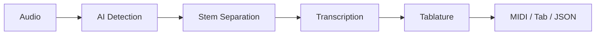

[](https://github.com/scottmills306/tab-agent-pro/actions/workflows/ci.yml)
[](https://github.com/scottmills306/tab-agent-pro)
[](https://github.com/scottmills306/tab-agent-pro)
[](https://www.python.org/downloads/)
[](LICENSE)
[](https://github.com/psf/black)
[](https://github.com/astral-sh/ruff)

# 🎸 Tab Agent

**Upload guitar or bass audio. Get tablature, MIDI, and JSON back.**

Tab Agent transcribes guitar and bass recordings into playable tablature using
a multi-engine AI pipeline. Works on anything from a clean DI track to a full
mix with drums and vocals.

👉 **[Try the live demo on HuggingFace Spaces](https://scottymills-tab-agent-pro.hf.space)**

---

## Quick Start

### Web UI (recommended)

```bash
pip install -r requirements.txt
python app.py
# Open http://localhost:7860
```

### CLI

```bash
python main.py input/your_song.wav
# Output: output/your_song_lead_guitar.tab
```

### Docker

```bash
docker build -t tab-agent .
docker run -v $(pwd)/input:/app/input tab-agent python main.py input/your_song.wav
```

---

## Pipeline



| Stage | Tool | What it does |
|-------|------|-------------|
| **Quality Analysis** | SunoDetector | Detects AI-generated audio artifacts, adjusts thresholds |
| **Stem Separation** | Demucs | Isolates guitar/bass from the mix |
| **Spatial Processing** | Mid-Side | Splits lead and rhythm guitars |
| **Transcription** | YourMT3+ / Basic Pitch | Converts audio → MIDI notes |
| **Tablature** | DP Viterbi | Assigns notes to strings/frets optimally |
| **Technique Detection** | Heuristic | Slides, hammer-ons, pull-offs |
| **Export** | — | MIDI, ASCII tab, JSON |

---

## Features

- **Two transcription engines** — YourMT3+ (primary, ~2.7GB model) with automatic fallback to Basic Pitch (lightweight, ONNX)
- **Full-mix processing** — Demucs separates guitar/bass even from complete songs
- **Multi-track output** — Lead guitar, rhythm L/R, bass in separate files
- **Column-aligned tablature** — Chords grouped vertically, easy to read
- **AI audio support** — Automatic detection and cleanup for Suno/Udio generated audio
- **Technique detection** — Slides (`s`), hammer-ons (`h`), pull-offs (`p`) annotated in output
- **REAPER integration** — Run transcription directly from the DAW via ReaPack
- **Zero GPU acceleration** — HuggingFace Spaces optimization for faster CPU inference
- **Profile presets** — 8 tuning profiles (standard, drop D, classical, 4/5-string bass, etc.)

---

## Output Formats

| Format | Content | Use case |
|--------|---------|----------|
| **MIDI** (`.mid`) | Standard MIDI file with note events | Import into any DAW |
| **ASCII Tab** (`.tab`) | Human-readable fretboard notation | Printing, sharing |
| **JSON** (`.json`) | Structured note/fret data | Custom applications |

### Example tablature output

```
=== Guitar - lead Tablature ===

E|-------3--5--7--8--10--12--|
B|---------------------------|
G|---------------------------|
D|--0--2---------------------|
A|---------------------------|
E|---------------------------|

Legend: s=slide, h=hammer-on, p=pull-off
```

---

## REAPER Integration

1. Extensions → ReaPack → Import repositories
2. Add: `https://raw.githubusercontent.com/scottmills306/tab-agent-pro/main/index.xml`
3. Install **Tab Agent** and **Tab Agent Settings**
4. Select audio → Run script

---

## Project Structure

```
├── app.py                 # Gradio web UI
├── agents.py              # Splitter, Ear, Tab agents
├── main.py                # CLI pipeline
├── suno_postprocessor.py  # AI audio artifact detection
├── init_memory.py         # Preset profiles
├── monitoring.py          # Structured logging + health
├── reaper/                # REAPER Lua scripts
├── tests/                 # 194 tests
├── examples/              # Demo audio
├── pyproject.toml         # Project config
├── Dockerfile             # HF Spaces deployment
└── CHANGELOG.md           # Release history
```

---

## Quality

| Metric | Value |
|--------|-------|
| Tests | 194 passing |
| Branch coverage | 84% |
| Type errors | 0 (mypy strict) |
| Security issues | 0 HIGH/CRITICAL |
| Lint errors | 0 (ruff) |
| Formatting | black |

---

## License

MIT — use it, modify it, share it.

---

*Built with [Basic Pitch](https://github.com/spotify/basic-pitch) by Spotify Research,
[YourMT3](https://huggingface.co/mimbres/YourMT3), [Demucs](https://github.com/facebookresearch/demucs) by Meta,
and [Gradio](https://gradio.app).*
