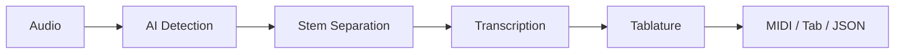

[](https://github.com/sgm-audio/tab-agent-pro/actions/workflows/ci.yml)
[](https://www.python.org/downloads/)
[](LICENSE)

# 🎸 Tab Agent

**Upload guitar or bass audio. Get tablature, MIDI, and JSON back.**

Tab Agent transcribes guitar and bass recordings into playable tablature using
a multi-engine AI pipeline. Works on anything from a clean DI track to a full
mix with drums and vocals.

---

## Quick Start

### Web UI (recommended)

```bash
pip install -r requirements.txt
python app.py
# Open http://localhost:7860
```

The server binds to `HOST` (default `0.0.0.0` so containers and Hugging Face
Spaces can reach it) and listens on `PORT` (default `7860`). Both are read from
the environment or from an optional `.env` file — see `.env.example`.

Uploads are limited to 50 MB, 5 minutes, and the formats
`.wav .mp3 .flac .ogg .m4a .aiff`; results are returned as a ZIP archive.

### CLI

```bash
python main.py input/your_song.wav
# Output: output/your_song_lead_guitar.tab
```

Useful flags:

```bash
python main.py song.wav --instrument Bass          # default: Guitar
python main.py song.wav --profile rock_drop_d      # preset profile (see init_memory.py --list)
python main.py song.wav --onset 0.4 --frame 0.3    # override profile thresholds
python main.py song.wav --no-midi --no-tab         # export JSON only
python main.py song.wav --output-dir /tmp/out
```

### Docker

```bash
docker build -t tab-agent .
docker run -p 7860:7860 -v $(pwd)/input:/app/input tab-agent
# or run the CLI inside the image:
docker run -v $(pwd)/input:/app/input tab-agent python main.py input/your_song.wav
```

The image binds `0.0.0.0:7860` (required by Hugging Face Spaces) and ships
Basic Pitch with its ONNX backend plus the stem-separation stack.

### Validation

```bash
python -m pytest tests/            # 245 tests
python validate.py                 # end-to-end checklist (PASS/FAIL summary)

python tools/check_index.py           # ReaPack index format
python tools/check_env_example.py     # every documented env var is read
python tools/check_docker_install.py  # basic-pitch pin + required deps
python tools/check_reaper_settings.py # REAPER settings reach main.py
```

---

## Pipeline


```mermaid
graph LR
    A[Audio] --> B[AI Detection]
    B --> C[Stem Separation]
    C --> D[Transcription]
    D --> E[Tablature]
    E --> F[MIDI / Tab / JSON]
```

| Stage | Tool | What it does |
|-------|------|-------------|
| **Quality Analysis** | SunoDetector | Detects AI-generated audio artifacts, adjusts thresholds |
| **Stem Separation** | Demucs (htdemucs) | Splits the mix into vocals / drums / bass / other; `bass` is transcribed as bass and `other` as guitar |
| **Spatial Processing** | Mid-Side | Splits lead (centre) from rhythm (sides) by subtraction |
| **Transcription** | YourMT3+ → Basic Pitch | Converts audio → MIDI notes (Basic Pitch is the always-available fallback) |
| **Tablature** | DP Viterbi | Assigns notes to strings/frets optimally; unplayable notes are skipped |
| **Technique Detection** | Heuristic | Slides, hammer-ons, pull-offs |
| **Export** | — | MIDI, ASCII tab, JSON |

---

## Features

- **Basic Pitch transcription** — Spotify's lightweight ONNX model, no GPU required
- **Full-mix processing** — Demucs separates the mix; the residual `other` stem (guitars and other instruments) is transcribed as guitar
- **Multi-track output** — Lead guitar, rhythm L/R, bass in separate files
- **Column-aligned tablature** — Chords grouped vertically; a single unplayable note no longer discards the whole track
- **AI audio support** — Automatic detection and cleanup for Suno/Udio AI-generated audio
- **Technique detection** — Slides (`s`), hammer-ons (`h`), pull-offs (`p`) annotated in output
- **Plug-and-play presets** — 8 profiles (standard, drop D, classical, 4/5-string bass, Suno cleanup, live band) applied with `--profile`
- **REAPER integration** — Run transcription from the DAW via ReaPack, with the settings-script values passed through as CLI flags
- **Runs on CPU or GPU** — CPU-only by default; the Gradio app uses Hugging Face Zero GPU when deployed on a ZeroGPU Space (`spaces.GPU` is a no-op elsewhere)

> **YourMT3+ status:** `agents.py` can load the YourMT3+ checkpoint from the
> Hugging Face Hub and falls back to Basic Pitch whenever it is unavailable. The
> Docker image ships Basic Pitch only; loading YourMT3+ additionally needs a
> multi-GB checkpoint download on first run (`HF_TOKEN` is honoured for gated
> repos, and `CACHE_DIR` controls where it is stored).

---

## Configuration

Environment variables (all optional; `.env` is read by `app.py` and `run.sh`):

| Variable | Default | Purpose |
|----------|---------|---------|
| `HOST` | `0.0.0.0` | Bind address for the web UI |
| `PORT` | `7860` | Port for the web UI (Spaces expects 7860) |
| `DEVICE` | `auto` | Torch device for transcription: `auto`, `cpu`, `cuda`, `mps` |
| `CACHE_DIR` | `~/.cache/tab_agent` | Model cache (YourMT3+ checkpoint and codebase) |
| `HF_TOKEN` | — | Hugging Face token for gated/private model repos |

Preset profiles configure tuning, thresholds and processing behaviour. Applying a
profile writes it to user memory so later runs (and the REAPER scripts) reuse it:

```bash
python init_memory.py --list                 # list the 8 profiles
python init_memory.py --profile bass_5_string
python main.py song.wav --profile suno_aggressive
```

Threshold precedence: explicit CLI flag → active profile → built-in default.

---

## Output Formats

| Format | Content | Use case |
|--------|---------|----------|
| **MIDI** (`.mid`) | Standard MIDI file with note events | Import into any DAW |
| **ASCII Tab** (`.tab`) | Human-readable fretboard notation | Printing, sharing |
| **JSON** (`.json`) | Structured note/fret data | Custom applications |

### Example tablature output

```
=== Guitar - lead Tablature ===

E|3 5 7 8s 10 12
B|-
G|-
D|0 2
A|-
E|-

Legend: s=slide, h=hammer-on, p=pull-off
```

Each column is one onset group (notes within 50 ms); a note is never merged
into its neighbour, and a string that is unused in a column shows `-`.

---

## REAPER Integration

1. Extensions → ReaPack → Import repositories
2. Add: `https://raw.githubusercontent.com/sgm-audio/tab-agent-pro/main/index.xml`
3. Install **Tab Agent** and **Tab Agent Settings**
4. Glue the item you want analysed, select it, then run **Tab Agent**

`Tab Agent Settings` stores the install path, profile, instrument, onset/frame
thresholds, output directory and export toggles in REAPER's ExtState.
`Tab Agent` passes those values to `main.py` as CLI flags, so what you configure
is what runs.

---

## Project Structure

```
├── app.py                 # Gradio web UI + FastAPI health endpoints
├── agents.py              # Splitter, Ear, Tab agents
├── main.py                # CLI pipeline + tab/JSON export helpers
├── suno_postprocessor.py  # AI audio artifact detection
├── init_memory.py         # Preset profiles
├── monitoring.py          # Structured logging + health
├── validate.py            # End-to-end checklist
├── reaper/                # REAPER Lua scripts
├── tools/                 # Config/deployment guard scripts
├── tests/                 # 245 tests
├── examples/              # Demo audio
├── pyproject.toml         # Project config
├── Dockerfile             # HF Spaces deployment
└── CHANGELOG.md           # Release history
```

---

## Deploying

### Hugging Face Spaces

The Space must be kept in sync with this repo. With a write token available:

```bash
export HF_TOKEN=hf_...
./tools/deploy_space.sh scottymills/tab-agent-pro
```

This uploads exactly the files the Space needs (`Dockerfile`, `requirements.txt`,
`agents.py`, `app.py`, `main.py`, `monitoring.py`, `init_memory.py`,
`suno_postprocessor.py`, `examples/`) — the file list the Docker Space runtime
expects. Health checks are available at `/health` and `/health/metrics`.

---

## License

MIT — use it, modify it, share it.

---

*Built with [Basic Pitch](https://github.com/spotify/basic-pitch) by Spotify Research,
[Demucs](https://github.com/facebookresearch/demucs) by Meta,
and [Gradio](https://gradio.app).*
